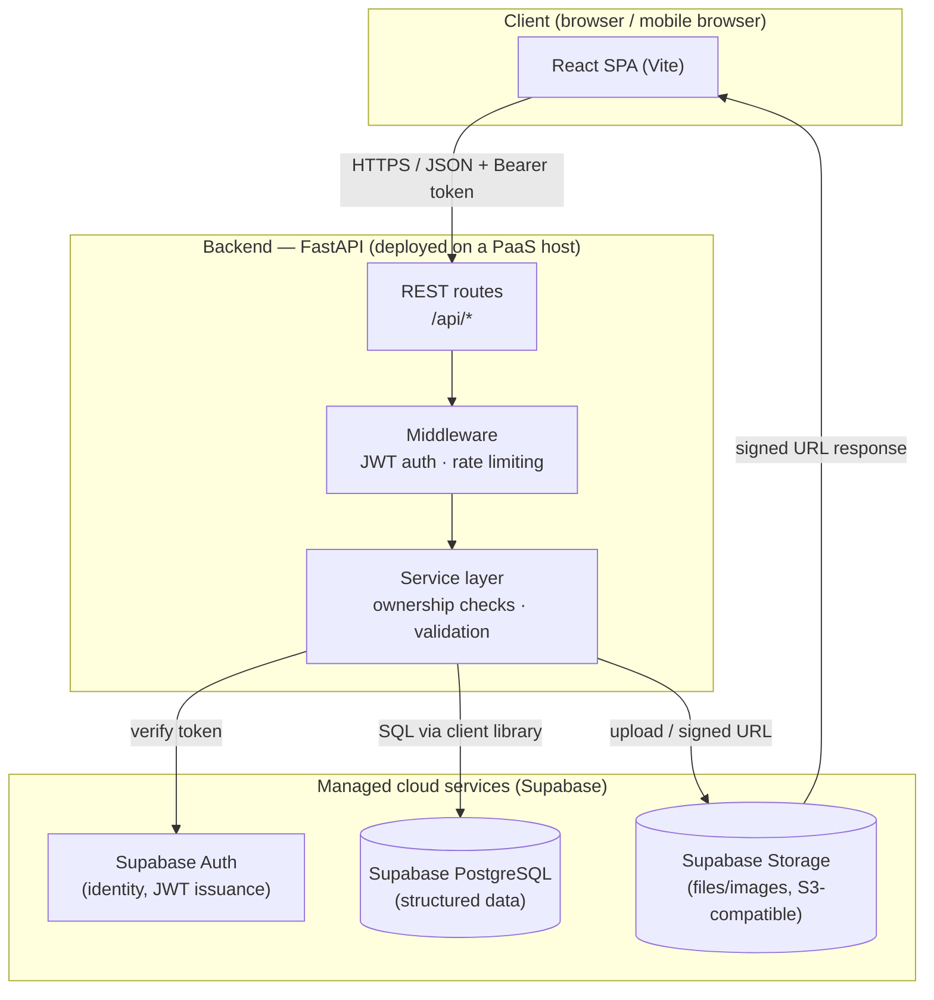
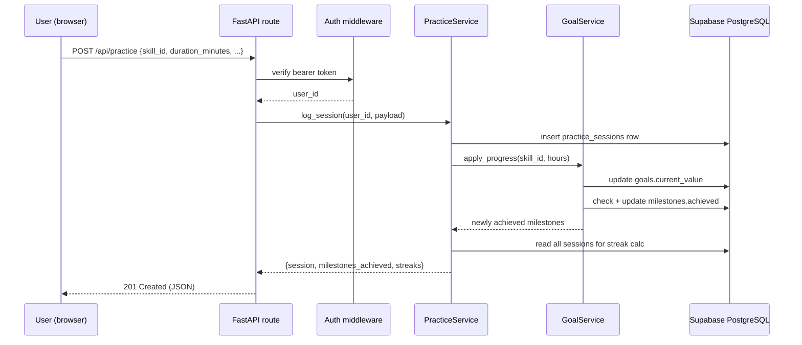
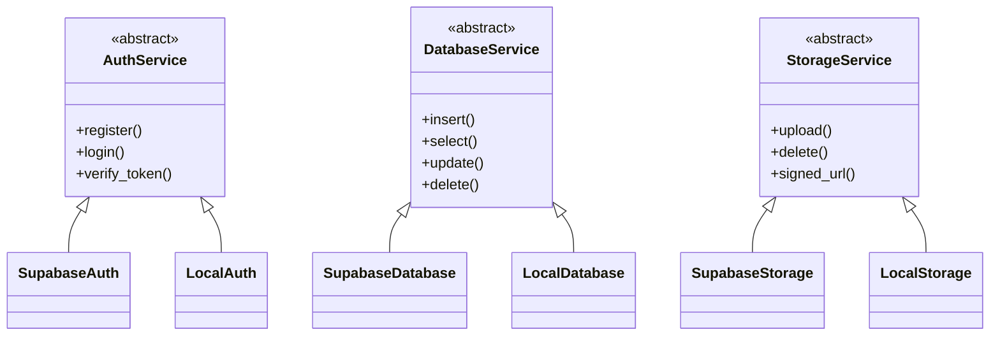
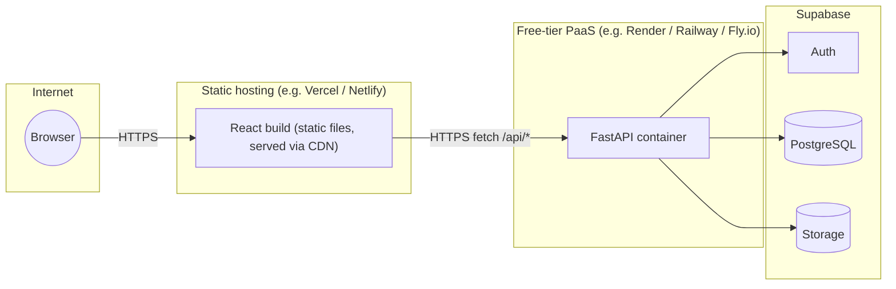

# System Architecture

## 1. High-level architecture

**Why the frontend never talks to Supabase directly in this project:** the
service-role key needed for some operations (e.g. deleting another table's
rows on cascade) must never reach the browser. Routing every request through
FastAPI keeps that key server-side only, and lets the backend enforce
ownership rules (`docs/security_and_privacy.md`) that a client-only app
cannot be trusted to enforce.

## 2. Request lifecycle (example: logging a practice session)

## 3. Cloud provider abstraction

The single biggest architectural decision in this project: **every cloud
capability is behind an interface**, with two implementations.

`cloud/factory.py` reads `CLOUD_PROVIDER` from the environment and builds
the matching trio. Every route and service is written against the abstract
interface, so **the exact same `backend/` code is what runs in local
simulation and in the deployed cloud version** — nothing is mocked out or
reimplemented for "demo mode."

## 4. Cloud computing concepts, mapped to code

See the table in the main `README.md` §3 for the full list. The two most
important ones to be able to explain out loud:

- **Authentication vs. authorization.** Authentication ("who are you?")
  happens once, in `backend/middleware/auth_middleware.py`, by verifying the
  JWT. Authorization ("are you allowed to touch *this* row?") happens
  separately, per-write, next to the data it protects — e.g.
  `SkillService._owned_skill()` checks `skill.user_id == caller_id` before
  any update or delete.
- **Serverless / elastic scaling.** The FastAPI process keeps no
  request-to-request state in memory (all state lives in the managed
  database), so a PaaS host can run zero, one, or many copies of it behind
  a load balancer without any code change — see
  `docs/scalability_and_reliability.md`.

## 5. Deployment topology

