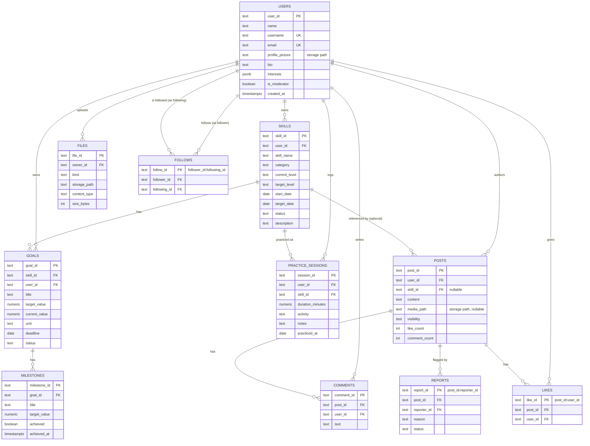

# Database Design

## Entity-relationship diagram



## Text ER diagram (for terminals / plain-text viewers)

```
USERS 1---* SKILLS 1---* GOALS 1---* MILESTONES
  |             |
  |             *---* PRACTICE_SESSIONS
  |
  *---* POSTS 1---* COMMENTS
  |       |
  |       1---* LIKES
  |       |
  |       1---* REPORTS
  |
  *---* FOLLOWS (self-referencing: follower_id -> USERS, following_id -> USERS)
  |
  *---* FILES
```

## Primary keys, foreign keys, relationships

- **Primary keys** are short prefixed strings generated in
  `backend/models/schemas.py` (e.g. `skl_4f2a9c1b0d3e`), not raw
  auto-increment integers — this makes it safe for a client to reference an
  id in a URL without leaking how many rows exist in the table.
- **Composite keys as constraints, not just IDs.** `likes.like_id` is built
  as `"<post_id>:<user_id>"`. This turns "a user can only like a post once"
  from an application rule into a *database-enforced* primary-key
  constraint — a second like insert hits a duplicate-key error before any
  counter is touched, even under a race condition. `follows.follow_id` and
  `reports.report_id` use the same pattern.
- **Foreign keys with `ON DELETE CASCADE`.** Deleting a user cascades to
  their skills, goals, sessions, posts, comments, likes, follows, and
  files — see `docs/schema.sql`. `posts.skill_id` uses `ON DELETE SET NULL`
  instead, because a post shouldn't disappear just because the referenced
  skill was later deleted.
- **Indexes** exist on every foreign key column used in a `WHERE`
  (`skills.user_id`, `posts.user_id`, `practice_sessions.user_id`, etc.),
  on `posts.created_at` for the feed's default sort, and a composite index
  on `(user_id, practiced_at)` for streak calculation, which scans one
  user's practice dates in date order.

## Query patterns this schema is optimized for

1. "All of my skills" → `SELECT * FROM skills WHERE user_id = ?` (indexed)
2. "The public feed, newest first" → `SELECT * FROM posts WHERE visibility='PUBLIC' ORDER BY created_at DESC LIMIT 20 OFFSET ?` (composite index)
3. "Did user X already like post Y?" → `SELECT 1 FROM likes WHERE like_id = 'Y:X'` (primary-key lookup, O(1))
4. "My practice dates, for streak calculation" → `SELECT practiced_at FROM practice_sessions WHERE user_id = ?` (composite index)

## Relational vs. NoSQL: why PostgreSQL was chosen here

| | Relational (chosen: PostgreSQL) | NoSQL (e.g. Firestore) |
|---|---|---|
| Data shape | Highly relational — goals belong to skills belong to users, milestones belong to goals | Works, but "deeply nested" and "cross-collection" data get awkward |
| Duplicate-like prevention | A `UNIQUE(post_id, user_id)` constraint at the database level | Requires a transaction or a security-rule trick to approximate the same guarantee |
| Aggregation for analytics | `GROUP BY`, `SUM()`, window functions do the heavy lifting in SQL | Usually pulled client-side or via a separate aggregation pipeline/Cloud Function |
| Free tier | Supabase: 500MB DB, generous for a student project | Firestore: generous read/write quota, but per-operation pricing model |
| Local simulation | Trivial — `LocalDatabase` mirrors the same table/row model in memory | Also possible (Firestore emulator), but a heavier local toolchain |

Either is a legitimate choice for this project; `cloud/database_service.py`
is written as an interface specifically so a `FirestoreDatabase`
implementation could be dropped in later without touching any service or
route code.
